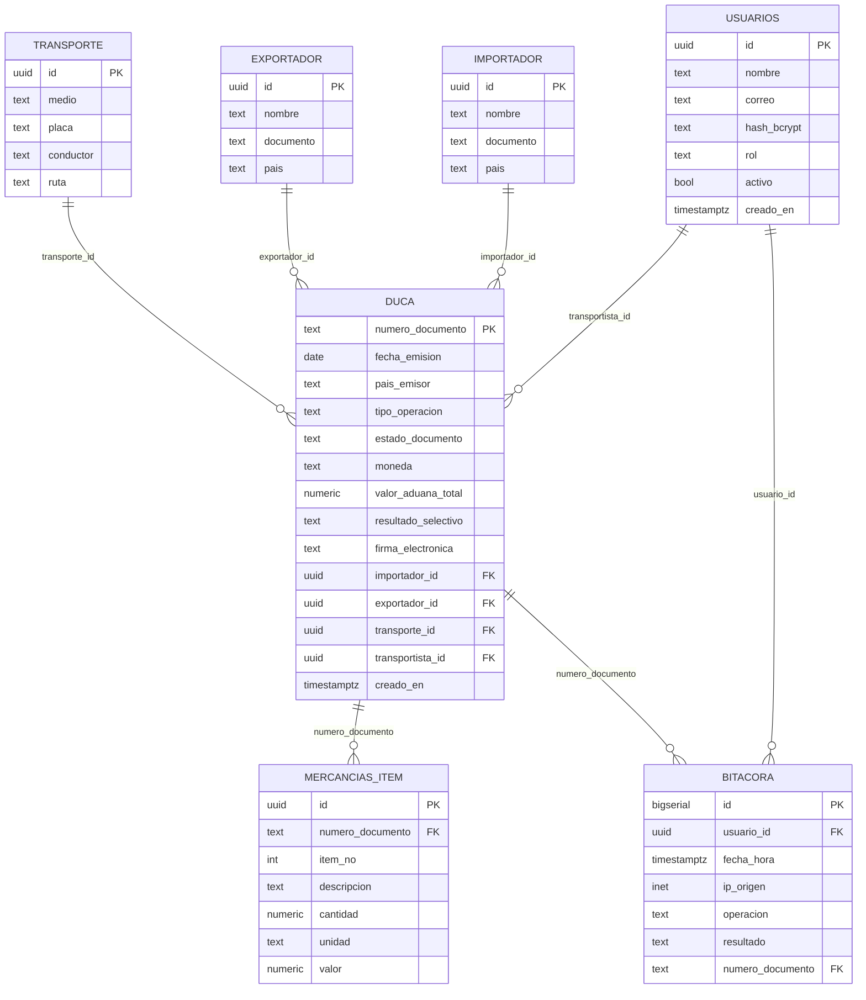

# ERD (Mermaid)

```mermaid
erDiagram
  USUARIOS {
    uuid id PK
    text nombre
    text correo
    text hash_bcrypt
    text rol
    bool activo
    timestamptz creado_en
  }

  IMPORTADOR {
    uuid id PK
    text nombre
    text documento
    text pais
  }

  EXPORTADOR {
    uuid id PK
    text nombre
    text documento
    text pais
  }

  TRANSPORTE {
    uuid id PK
    text medio
    text placa
    text conductor
    text ruta
  }

  DUCA {
    text numero_documento PK
    date fecha_emision
    text pais_emisor
    text tipo_operacion
    text estado_documento
    text moneda
    numeric valor_aduana_total
    text resultado_selectivo
    text firma_electronica
    uuid importador_id FK
    uuid exportador_id FK
    uuid transporte_id FK
    uuid transportista_id FK
    timestamptz creado_en
  }

  MERCANCIAS_ITEM {
    uuid id PK
    text numero_documento FK
    int item_no
    text descripcion
    numeric cantidad
    text unidad
    numeric valor
  }

  BITACORA {
    bigserial id PK
    uuid usuario_id FK
    timestamptz fecha_hora
    inet ip_origen
    text operacion
    text resultado
    text numero_documento FK
  }

  USUARIOS ||--o{ DUCA : "transportista_id"
  IMPORTADOR ||--o{ DUCA : "importador_id"
  EXPORTADOR ||--o{ DUCA : "exportador_id"
  TRANSPORTE ||--o{ DUCA : "transporte_id"
  DUCA ||--o{ MERCANCIAS_ITEM : "numero_documento"
  USUARIOS ||--o{ BITACORA : "usuario_id"
  DUCA ||--o{ BITACORA : "numero_documento"
```
